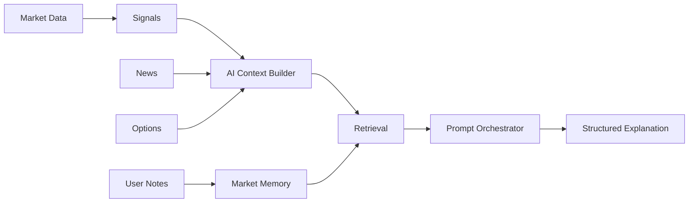

# AI Integration Plan

## Executive Summary

AI should reduce cognitive load and explain market intelligence. It should not start as a generic chatbot. The correct architecture is structured context packets, retrieval-backed market memory, and deterministic data contracts that let AI explain signals, watchlists, sectors, options setups, risk, and news without inventing facts.

## P0 Requirements

### Structured Context Packets

Implemented foundation:

- `AIContextPacket`
- `AIWorkflowKind`
- `AIContextBuilder`
- `MarketMemoryStore`

Every AI workflow should receive structured facts, provenance, timestamps, and warnings. This is the guardrail against vague or hallucinated market commentary.

Phase 4 implementation status:

- `ai-context-service` now builds structured context packets for ticker signal explanations, watchlist briefs, and options reasoning.
- `StructuredAIContextBuilder` renders deterministic context text from structured packets.
- `InMemoryMarketMemoryStore` provides a local retrieval-memory port that can later be replaced with a vector database.
- No generic chatbot has been added.

### Explainability Targets

Initial AI workflows should explain:

- why a ticker ranks highly
- what changed in a watchlist
- which factors drove a scanner result
- what risk changed in a portfolio
- what options setup assumptions matter
- what news changed the market context

### Retrieval Layer

Market memory should store:

- signal snapshots
- factor changes
- user notes
- watchlist membership
- earnings events
- news summaries
- prior AI explanations
- options flow highlights

## P1 Architecture

## P1 Workflows

### Signal Explanation

Input:

- ticker
- latest quote
- factor outputs
- factor deltas
- sector context
- stale data warnings

Output:

- bullish and bearish drivers
- confidence notes
- missing data warnings
- what to watch next

### Watchlist Brief

Input:

- watchlist symbols
- strongest movers
- signal deltas
- event calendar
- news highlights

Output:

- ranked changes
- regime notes
- action-oriented monitoring list

### Options Setup Explanation

Input:

- options chain
- IV rank
- expected move
- Greeks
- flow highlights
- earnings/event context

Output:

- setup type
- volatility assumptions
- risk points
- invalidation conditions

## P2 Workflows

- Chart explanation from overlays and indicators.
- Portfolio risk review.
- AI-generated screener templates.
- Macro regime narrative.
- Alert triage and prioritization.

## Safety And Quality Rules

- AI output must cite source timestamps and stale data warnings.
- AI should distinguish observation from inference.
- AI should not make trade guarantees.
- AI should not hide missing data.
- AI should generate structured summaries that the UI can render predictably.

## Migration Order

1. Add `AIContextPacket` contracts.
2. Add context builders for ticker, watchlist, and screener result.
3. Add storage interface for market memory.
4. Add deterministic explanation tests with fixed inputs.
5. Add retrieval-backed summaries only after source data is persistent.

## Phase 4 Service Boundary

AI remains an intelligence layer over deterministic market data, not a free-form chat surface.

- Ticker context packets include quote facts, legacy signal scores, trend labels, conviction tier, and explicit constraints.
- Watchlist context packets include market regime, market session, and top signal outputs.
- Options reasoning packets explicitly mark options data as unavailable until a provider is connected, preventing invented Greeks, flow, IV rank, or exposure.
