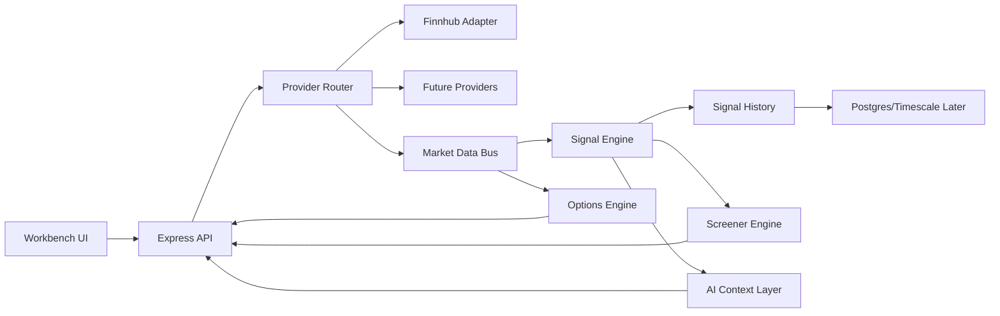

# Architecture Report

## Executive Summary

`stock-terminal` is a working prototype with a useful signal vocabulary and a deployable Render baseline. The current architecture is still Replit-era: the API, data provider logic, scoring engine, signal history, and dashboard joins are tightly coupled around Finnhub and in-memory state. That is acceptable for a single-user free deployment, but it will not scale cleanly into an institutional market intelligence workstation without a staged modularization effort.

The correct path is not a rewrite. Preserve the existing dashboard and API behavior, then extract stable platform domains behind typed adapters.

## Current System Shape

- `artifacts/api-server/src/app.ts` owns Express app wiring, API route registration, production static asset serving, and SPA fallback.
- `artifacts/api-server/src/lib/finnhub.ts` owns Finnhub REST calls, websocket subscriptions, provider-specific normalization, caches, refresh loops, rate-limit handling, and market regime calculation.
- `artifacts/api-server/src/lib/scores.ts` owns most scoring formulas and factor definitions in one large procedural module.
- `artifacts/api-server/src/lib/scanner.ts` owns scanner universe, scanner fetch logic, scoring calls, and scanner-specific cache state.
- `artifacts/api-server/src/lib/signal-history.ts` owns JSON persistence, in-memory live score state, delta computation, and mutations triggered by read APIs.
- `artifacts/live-dashboard/src/pages/Dashboard.tsx` and dashboard components own query orchestration, watchlist display, filtering, sorting, tooltips, and dense data presentation.
- `lib/db/src/schema/index.ts` is effectively empty, so persistent market intelligence models are not yet formalized.

## P0 Issues

- The API data provider is not a provider abstraction. `finnhub.ts` mixes transport, provider schema, normalized market data, caching, subscriptions, and derived metrics. This blocks clean multi-provider support, failover, and options data expansion.
- `/api/scores` style flows combine read behavior with signal-history writes. Query endpoints should not have hidden persistence side effects.
- Market intelligence state is mostly process memory plus JSON disk cache. Render Free may restart or sleep, and `/tmp` storage is temporary. This is fine for a baseline, but not for durable analytics, alerts, backtests, or multi-user workspaces.
- Signal formulas are not registered as composable factors. Existing VQS/GVS/COS/INS/ACS/CSOS/CPE/BPS/LQS logic is valuable, but it is difficult to backtest, rank, explain, or reuse independently.

## P1 Issues

- Frontend data joins and presentation concerns are coupled in dense dashboard components. This makes future scanner, chart, options, and AI explanation panels harder to add safely.
- There is no internal event bus for quotes, candles, scores, deltas, alerts, and options events.
- There is no canonical instrument identity model. Tickers are treated as strings across providers and UI flows.
- There is no workspace model for layouts, panels, watchlists, user preferences, or multi-monitor workflows.
- Charting is not isolated as a domain. This will matter when indicators, drawings, overlays, and multi-timeframe views become first-class.

## P2 Issues

- Replit-related files and prototype artifacts are harmless but should remain isolated from production deployment decisions.
- Documentation does not yet explain provider boundaries, scoring semantics, deployment assumptions, or migration order.
- Domain vocabulary exists in code comments and UI labels, but not as typed platform contracts.

## New Domain Foundation

The new `lib/market-platform` package establishes typed public interfaces for:

- `MarketDataProvider`
- `MarketEvent`
- `MarketDataBus`
- `CacheProvider`
- `SignalDefinition`
- `FactorDefinition`
- `IndicatorDefinition`
- `StrategyDefinition`
- `OptionsChain`
- `OptionContract`
- `Greeks`
- `VolatilitySurface`
- `AIContextPacket`
- `WorkspaceLayout`

This package is intentionally interface-first. It gives future refactors a stable target without breaking the live dashboard.

## Phase 2 Adapter Boundary

Phase 2 has started with an API-server service layer that wraps the existing working modules while preserving public API responses.

- `market-data-service` exposes the current Finnhub-backed quote, metrics, market status, market regime, and mover flows behind a provider-shaped boundary.
- `score-service` centralizes current score generation and sector rotation while continuing to call the existing `computeScore` formulas.
- `scanner-service` wraps current scanner state and refresh behavior.
- `signal-history-service` isolates the current score observation and snapshot side effects so they can be moved out of read endpoints later.
- `normalizers` map current API data to `lib/market-platform` contracts for internal use only; response payloads remain unchanged.
- `registries` provide in-memory registry shells for signals, indicators, factors, and strategies without migrating formulas yet.

Deferred by design:

- Finnhub remains the only active provider.
- Formula extraction moves to Phase 3.
- Persistent database migration remains a later step.
- Dashboard UX is unchanged in this phase.

## Phase 3 Engine Foundation

Phase 3 begins the market-data and signal-engine foundation without changing public API responses.

- `market-data-bus` provides an in-memory `MarketDataBus` for normalized quote, signal, provider, news, and future options events.
- `cache-service` provides a `CacheProvider` implementation for short-lived in-process state and future Redis replacement.
- `provider-router-service` routes capabilities to the active Finnhub provider and creates a stable place for future provider failover.
- `signal-engine-service` registers legacy VQS/GVS/COS/INS/ACS/CSOS/CPE/BPS/LQS factors as composable `FactorDefinition` adapters over current `computeScore` output.
- `score-service` now publishes internal `signal.updated` events after score computation while preserving the existing `/api/scores` payload.

## Phase 4 Options And AI Foundation

Phase 4 adds reusable options analytics and AI context services without changing the current dashboard or public API payloads.

- `options-analytics-service` implements baseline Greeks, volatility, dealer exposure, flow detection, and strategy payoff service boundaries.
- `ai-context-service` creates structured AI context packets for ticker, watchlist, and options reasoning workflows.
- AI context packets include explicit constraints so future AI output can explain signals without inventing missing data.
- Options reasoning explicitly remains provider-gated until normalized options-chain data exists.

## Migration Order

1. Keep the live Render deployment stable.
2. Add platform contracts in `lib/market-platform`.
3. Wrap current Finnhub logic in a `MarketDataProvider` adapter without changing API responses.
4. Extract scoring formulas from `scores.ts` into registered `FactorDefinition` modules.
5. Move signal-history writes out of read endpoints into explicit event or snapshot workflows.
6. Introduce contract tests for provider normalization and signal outputs.
7. Add persistent database schemas after event and signal models are stable.
8. Introduce workstation UX panels once data boundaries are cleaner.

## Target Architecture

